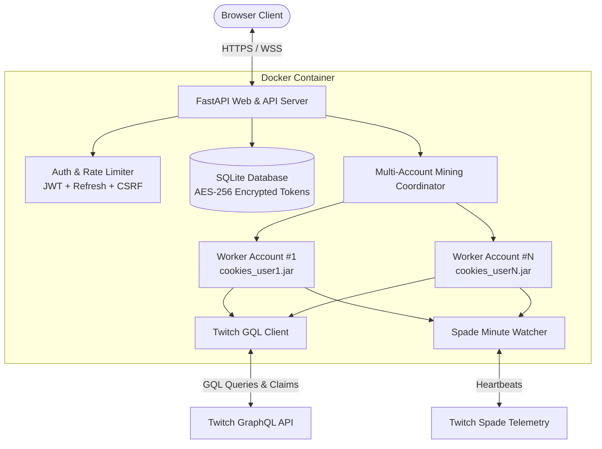

<div align="center">

<p align="center">
  
</p>

# 🎮 Twitch Drop Miner

<p align="center">
  <a href="https://github.com/MatinMHF/twitch-drop-miner/actions/workflows/ci.yml"></a>
  <a href="https://github.com/MatinMHF/twitch-drop-miner/releases"></a>
  <a href="https://www.docker.com/"></a>
  <a href="https://fastapi.tiangolo.com/"></a>
  <a href="https://react.dev/"></a>
  <a href="LICENSE"></a>
</p>

<p align="center">
  <a href="https://git.io/typing-svg">
    
  </a>
</p>

<p align="center">
  A modern, production-grade, self-hosted web service for automatic Twitch Drop mining.<br/>
  Emulates viewer telemetry via lightweight GraphQL heartbeats without streaming video or audio.
</p>

<p align="center">
  <a href="#-key-features"><b>Features</b></a> •
  <a href="#-quick-start-with-docker"><b>Quick Start</b></a> •
  <a href="#-updating-to-the-latest-version"><b>Updating</b></a> •
  <a href="#-architecture"><b>Architecture</b></a> •
  <a href="#%EF%B8%8F-configuration--constants"><b>Configuration</b></a> •
  <a href="#-security-model"><b>Security</b></a> •
  <a href="#-contributing"><b>Contributing</b></a>
</p>

</div>

---

## 📸 Interactive Dashboard Preview

```text
+-----------------------------------------------------------------------------------+
|  [Tv] Twitch Drop Miner  v1.2.1      (•) Telemetry Live   [2 Accounts Active] [⚙] |
+-----------------------------------------------------------------------------------+
|  [ Status: MINING ]  [ Claimed: 26 ]  [ Watchlist: 33 ]  [ Bandwidth Saved: 99.9% ]|
+-----------------------------------------------------------------------------------+
|  CONCURRENT MINING ACCOUNTS (Parallel Execution)                                 |
|  • @Account1: BlizzCon Day 1 Drop 6 (78.3%) -> @ow_esports (Overwatch)            |
|  • @Account2: Rust Drops (100% Claimed)    -> IDLE                                |
+-----------------------------------------------------------------------------------+
|  [ Game Watchlist (Priority Queue) - Drag & Drop ]  |  [ Discovered Campaigns ]   |
|  :: #1. Rainbow Six Siege [✓ All Drops Claimed] [▲▼]|  • nopixel V (Active)       |
|  :: #2. Rust              [✓ All Drops Claimed] [▲▼]|  • Overwatch 2 Esports      |
|  :: #3. Cyberpunk 2077    [⏳ Waiting for Drops][▲▼]|  • Valorant Champions Drops |
|  :: #4. Grand Theft Auto V [Mining Now (2 drops)]    |  • Apex Legends Drops       |
+-----------------------------------------------------------------------------------+
|  [ Claimed Rewards History ]                        |  [ Real-Time Logs ]         |
|  ✓ GTA$250K - Claimed 1h ago                        |  [01:05:25] Telemetry live  |
|  ✓ Overwatch Spray - Claimed 2h ago                 |  [01:06:25] Claim confirmed |
+-----------------------------------------------------------------------------------+
```

---

## ✨ Key Features

| Capability | Technical Implementation | Value |
| :--- | :--- | :--- |
| 👥 **Multi-Account Mining** | `MultiAccountMiningManager` orchestrates N isolated workers with per-account cookie jars (`cookies_<user_id>.jar`) | Mine and claim drops across multiple accounts simultaneously without session collisions. |
| ⚡ **Zero-Bandwidth Engine** | Emulates minute-watched telemetry via Twitch GQL & Spade API (no video/audio downloaded) | Consumes only ~1-2 KB/min (~80MB RAM), saving over 99.9% network bandwidth. |
| 🔒 **Twitch Device OAuth 2.0** | Official TV/Console Device Code Grant (`twitch.tv/activate`) with activation code & QR | Zero Twitch passwords or 2FA credentials handled; no brittle browser automation needed. |
| 🎯 **Drag-and-Drop Watchlist** | HTML5 drag-and-drop with visual grab handles (`GripVertical`) and viewport edge auto-scroll | Effortlessly reorder game priorities even in massive watchlists (30+ games). |
| 📊 **Accurate Drop Availability** | Evaluates real-time preconditions, campaign time windows, and claimed benefits | Accurately labels games as `All Drops Claimed`, `Active Drops`, or `Waiting`. |
| 🔄 **Streamer Failover** | Continually monitors active broadcaster status and auto-discovers drop-enabled streams | Automatically switches to another live streamer if current channel goes offline. |
| 🎁 **Instant Auto-Claim** | Real-time Twitch PubSub WebSocket events trigger `ClaimDropMutation` within milliseconds | Chained drops start progressing immediately without missing time windows. |
| 🛡️ **Military-Grade Security** | AES-256-GCM token encryption at rest, bcrypt password hashing, rotating JWT refresh cookies | Complete peace of mind for self-hosting on any server or VPS. |

---

## 🚀 Quick Start with Docker

### 1. Clone the repository
```bash
git clone https://github.com/MatinMHF/twitch-drop-miner.git
cd twitch-drop-miner
```

### 2. Configure Environment (Optional)
```bash
cp .env.example .env
```

### 3. Launch with Docker Compose
```bash
docker compose up -d --build
```

### 4. Access Web Dashboard
Open your browser at:
👉 **`http://localhost:8080`**

*On first launch, follow the initial setup wizard to create your master administrator credentials.*

---

## 🔄 Updating to the Latest Version

To update an existing deployment without losing your database, tokens, or custom settings:

### Automated Script:
```bash
# Linux / macOS
chmod +x update.sh && ./update.sh

# Windows
update.bat
```

### Manual Command:
```bash
git pull
docker compose pull
docker compose up -d --build
```

---

<details>
<summary><b>🏗 Click to Expand System Architecture &amp; Data Flow</b></summary>
<br/>



</details>

---

<details>
<summary><b>⚙️ Click to Expand Configuration &amp; Persisted Query Registry</b></summary>
<br/>

All Twitch GraphQL Persisted Query Hashes and endpoints are centralized in `backend/app/core/twitch_constants.py`. When Twitch modifies their GQL schema, you can hotfix hashes directly in `.env` without altering code:

| Variable | Default | Description |
| :--- | :--- | :--- |
| `PORT` | `8080` | Web server listening port |
| `DATA_DIR` | `./data` | Persistent SQLite database and secrets storage directory |
| `REQUIRE_HTTPS` | `false` | Enforce HTTPS redirects and HSTS headers |
| `POLL_INTERVAL_MINUTES` | `30` | Interval to poll Twitch for new drop campaigns |
| `WATCH_HEARTBEAT_SECONDS` | `60` | Stream watch heartbeat interval |
| `TWITCH_SPADE_URL` | `https://spade.twitch.tv/batched` | Twitch analytics minute-watched endpoint |
| `TWITCH_HASH_DROP_CAMPAIGN_DETAILS` | `039277b...` | SHA-256 hash for campaign details GQL query |
| `TWITCH_HASH_AVAILABLE_DROPS` | `782dad0...` | SHA-256 hash for available drops GQL query |
| `TWITCH_HASH_VIEWER_DROPS_DASHBOARD` | `d9cae77...` | SHA-256 hash for drop inventory / dashboard query |
| `TWITCH_HASH_CLAIM_DROP` | `a455dee...` | SHA-256 hash for drop claiming GQL mutation |
| `TWITCH_HASH_DIRECTORY_GAME` | `86bcceb...` | SHA-256 hash for game directory channel list query |
| `TWITCH_HASH_PLAYBACK_ACCESS_TOKEN` | `ed230aa...` | SHA-256 hash for stream playback access token query |

</details>

---

<details>
<summary><b>🛠️ Click to Expand Bare-Metal Local Development Setup</b></summary>
<br/>

### Backend Setup
```bash
cd backend
python -m venv .venv
source .venv/bin/activate  # Windows: .venv\Scripts\activate
pip install -r requirements.txt
python -m uvicorn app.main:app --host 0.0.0.0 --port 8080 --reload
```

### Frontend Setup
```bash
cd frontend
npm install
npm run build # Builds production SPA into backend/static
# Or run live dev server:
npm run dev
```

### Run Tests
```bash
PYTHONPATH=backend pytest backend/tests
```

</details>

---

## 🔐 Security Model

1. **AES-256-GCM Encryption**: OAuth tokens are encrypted using AES-GCM-256 with distinct 12-byte random initialization vectors before being written to SQLite.
2. **Rotating Refresh Tokens**: Access tokens expire in 15 minutes; refresh tokens are stored in secure HTTP-only cookies and rotated upon each refresh.
3. **Double-Submit CSRF**: Mutation endpoints enforce double-submit CSRF validation matching request headers against session cookies.
4. **Log Redaction**: Automatic log stream filter strips Bearer tokens, passwords, cookies, and OAuth payloads from all stdout/stderr logs.

---

<details>
<summary><b>🗑️ Click to Expand Uninstallation Guide</b></summary>
<br/>

To completely tear down the service and remove all containers, images, and data:

```bash
docker compose down -v
docker rmi twitch-drop-miner:latest
cd ..
rm -rf twitch-drop-miner
```

> [!WARNING]
> Passing the `-v` flag removes the persistent Docker data volume (`./data`). This permanently deletes your SQLite database, settings, game watchlist, and encrypted Twitch OAuth tokens.

</details>

---

## 🤝 Contributing

Contributions are welcome! Please review [CONTRIBUTING.md](CONTRIBUTING.md) for details on code style, testing, and pull request procedures.

---

## 📄 License

This project is licensed under the **MIT License** — see the [LICENSE](LICENSE) file for details.
