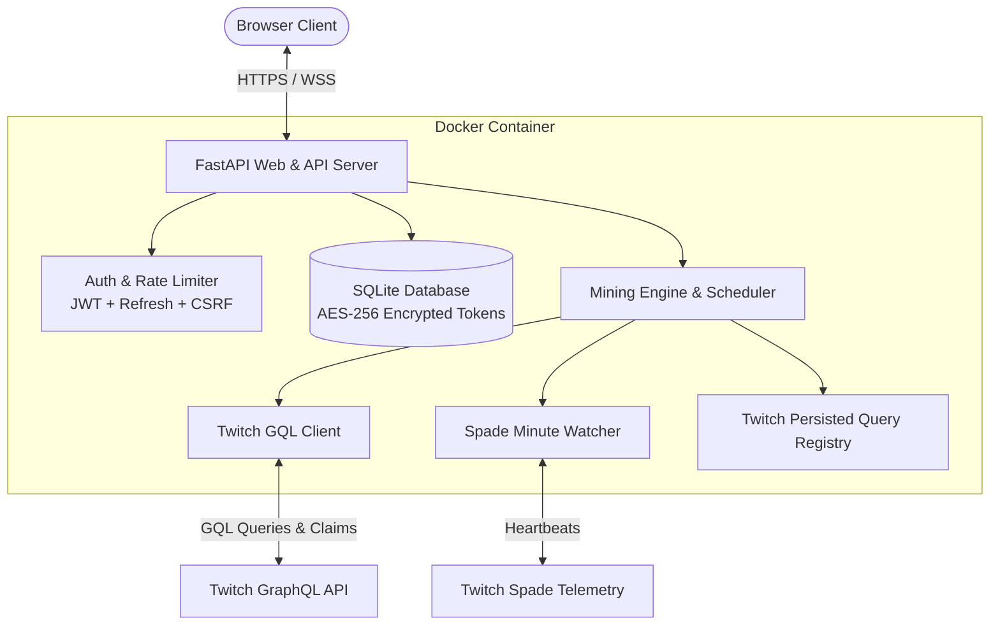

# 🎮 Twitch Drop Miner

<div align="center">

[](https://github.com/MatinMHF/twitch-drop-miner/actions/workflows/ci.yml)
[](https://www.docker.com/)
[](https://fastapi.tiangolo.com/)
[](https://react.dev/)
[](https://tailwindcss.com/)
[](https://opensource.org/licenses/MIT)

A modern, standalone, self-hosted web service for automatic Twitch Drop mining. Built 100% from scratch with a clean-room architecture.

[Features](#-key-features) • [Quick Start](#-quick-start-with-docker) • [Architecture](#-architecture) • [Configuration](#%EF%B8%8F-configuration--constants) • [Security](#-security-model) • [Contributing](#-contributing)

</div>

---

## 📸 Dashboard Preview

```text
+-----------------------------------------------------------------------------------+
|  [Tv] Twitch Drop Miner  v1.0.0      (•) Telemetry Live   [@MatinMHF]  [⚙] [🌙] [🚪] |
+-----------------------------------------------------------------------------------+
|  [ Status: MINING ]  [ Claimed: 14 ]  [ Watchlist: 5 ]  [ Bandwidth Saved: 99.9% ]|
+-----------------------------------------------------------------------------------+
|  ACTIVE MINING OPERATION                                                          |
|  Channel: @TopStreamer (Live) [12.4k viewers]                                     |
|  Reward: Legendary Skin Drop (Rust Campaign)                                     |
|  Progress: [████████████████████████░░░░░░] 78% (94 / 120 mins)  [Est. 26m left]   |
+-----------------------------------------------------------------------------------+
|  [ Game Watchlist (Priority Queue) ]    |  [ Active Discovered Campaigns ]        |
|  1. Rust           [Auto-Mine: ON] [▲▼] |  • Rust Drops Event (Ends Oct 12)       |
|  2. Escape From Tarkov [Auto-Mine: ON]  |  • Overwatch 2 Community Campaign       |
|  3. Apex Legends   [Auto-Mine: ON]      |  • Valorant Champions Drops             |
+-----------------------------------------------------------------------------------+
|  [ Claimed Rewards History ]            |  [ Real-Time Telemetry & Event Logs ]   |
|  ✓ AK-47 Skin - Claimed 10m ago         |  [12:15:00] Dispatched Spade heartbeat  |
|  ✓ Tactical Vest - Claimed 2h ago       |  [12:16:00] Dispatched Spade heartbeat  |
+-----------------------------------------------------------------------------------+
```

---

## ✨ Key Features

- 🔒 **Twitch OAuth 2.0 Device Flow**: Authenticate seamlessly using standard TV/Console device activation codes (`twitch.tv/activate`). No passwords, no 2FA credentials entered, and zero brittle browser automation (Puppeteer/Selenium).
- ⚡ **Headless Zero-Bandwidth Mining**: Emulates minute-watched viewing events directly via Twitch GraphQL and Spade telemetry without downloading video or audio streams (saves ~99.9% bandwidth, using ~1KB/min).
- 🔍 **Dynamic Game & Campaign Discovery**: Queries Twitch APIs directly to search games and discover active/upcoming drop events.
- 📋 **Priority Watchlist**: Organize watchlisted games with drag-and-drop or rank adjustments. Automatically transitions to the next available campaign or drop reward.
- 🔄 **Smart Streamer Failover**: Detects when a current streamer goes offline and automatically switches to the next top eligible streamer broadcasting the same game with drops enabled.
- 🎁 **Automated Reward Claiming**: Automatically triggers `ClaimDropMutation` when drops reach 100% and stores the reward history in a persistent SQLite database.
- 🛡️ **Hardened Security**:
  - OAuth access and refresh tokens are encrypted at rest using **AES-256-GCM**.
  - Admin login secured with **bcrypt** hashing.
  - Short-lived JWT access tokens with rotating refresh cookies.
  - Sliding-window rate limiting on sensitive routes.
  - CSRF protection and sanitized log streams that mask secrets.
- ⚙️ **Configurable Constants Registry**: Centralized storage for Spade endpoints and Twitch GraphQL persisted query hashes (with full `.env` override capability).
- 📱 **Modern Responsive UI**: Built with React 18, Vite, TypeScript, and Tailwind CSS with full dark/light theme support and real-time WebSocket telemetry.

---

## 🏗 Architecture



---

## 🚀 Quick Start with Docker

### 1. Clone the repository
```bash
git clone https://github.com/MatinMHF/twitch-drop-miner.git
cd twitch-drop-miner
```

### 2. Configure Environment (Optional)
```bash
cp .env.example .env
```

### 3. Launch with Docker Compose
```bash
docker compose up -d --build
```

### 4. Access Web Dashboard
Open your browser at:
👉 **`http://localhost:8080`**

On first launch, follow the initial setup wizard to create your admin username and password.

---

## ⚙️ Configuration & Constants

All Twitch GraphQL Persisted Query Hashes and endpoints are centralized in `backend/app/core/twitch_constants.py`. When Twitch modifies their GQL schema, you can hotfix hashes directly in `.env` without altering code:

| Variable | Default | Description |
| :--- | :--- | :--- |
| `PORT` | `8080` | Web server listening port |
| `DATA_DIR` | `./data` | Persistent SQLite database and secrets storage directory |
| `REQUIRE_HTTPS` | `false` | Enforce HTTPS redirects and HSTS headers |
| `POLL_INTERVAL_MINUTES` | `30` | Interval to poll Twitch for new drop campaigns |
| `WATCH_HEARTBEAT_SECONDS` | `60` | Stream watch heartbeat interval |
| `TWITCH_SPADE_URL` | `https://spade.twitch.tv/batched` | Twitch analytics minute-watched endpoint |
| `TWITCH_HASH_DROP_CAMPAIGN_DETAILS` | `14b5532...` | SHA-256 hash for campaign details GQL query |
| `TWITCH_HASH_AVAILABLE_DROPS` | `b194971...` | SHA-256 hash for available drops GQL query |
| `TWITCH_HASH_CLAIM_DROP` | `2f813d6...` | SHA-256 hash for drop claiming GQL mutation |

---

## 🛠️ Bare-Metal Installation

### Backend
```bash
cd backend
python -m venv .venv
source .venv/bin/activate  # Windows: .venv\Scripts\activate
pip install -r requirements.txt
python -m uvicorn app.main:app --host 0.0.0.0 --port 8080 --reload
```

### Frontend
```bash
cd frontend
npm install
npm run build # builds static SPA into backend/static
# Or run live dev server:
npm run dev
```

### Running Tests
```bash
PYTHONPATH=backend pytest backend/tests
```

---

## 🔐 Security Model

1. **AES-256-GCM Encryption**: OAuth tokens are encrypted using AES-GCM-256 with distinct 12-byte random initialization vectors before being written to SQLite.
2. **Rotating Refresh Tokens**: Access tokens expire in 15 minutes; refresh tokens are stored in secure HTTP-only cookies and rotated upon each refresh.
3. **Double-Submit CSRF**: Mutation endpoints enforce double-submit CSRF validation matching request headers against session cookies.
4. **Log Redaction**: Automatic log stream filter strips Bearer tokens, passwords, cookies, and OAuth payloads from all stdout/stderr logs.

---

## 🗑️ Uninstallation

To completely tear down the service and remove all containers, images, and data:

```bash
docker compose down -v
docker rmi twitch-drop-miner:latest
cd ..
rm -rf twitch-drop-miner
```

> [!WARNING]
> Passing the `-v` flag removes the persistent Docker data volume (`./data`). This permanently deletes your SQLite database, settings, game watchlist, and encrypted Twitch OAuth tokens.

---

## 🤝 Contributing

Contributions are welcome! Please review [CONTRIBUTING.md](CONTRIBUTING.md) for details on code style, testing, and pull request procedures.

---

## 📄 License

This project is licensed under the **MIT License** — see the [LICENSE](LICENSE) file for details.

