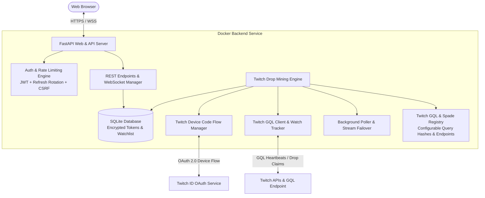

# Twitch Drop Miner (Self-Hosted Web Service) — Architecture & Implementation Plan

## 1. Executive Summary & Core Principles

This project provides a standalone, secure, self-hosted web service that automates Twitch Drop discovery, stream watching (via lightweight GraphQL heartbeats without streaming video/audio), and drop claiming.

> [!NOTE]
> **Reference Implementation**: This project is developed with direct inspiration from [`fireph/docker-twitch-drops-miner`](https://github.com/fireph/docker-twitch-drops-miner). Core logic, GQL structures, and Docker configuration patterns are adapted and extended from that project, with full attribution. Significant differences include a rewritten security layer, a new REST + WebSocket API surface, a React TypeScript frontend, and AES-256-GCM token encryption at rest.

---

## 2. Developer Tooling & AI Skills

The following Claude skills are installed and active throughout development to enforce quality, structure, and efficiency.

| Skill | Source | Purpose |
| :--- | :--- | :--- |
| **Superpowers** | [obra/superpowers](https://github.com/obra/superpowers) | Pre-coding discipline: enforce test writing and structured thinking before any implementation begins. |
| **Skills** | [mattpocock/skills](https://github.com/mattpocock/skills) | Break complex tasks into smaller, well-scoped sub-problems with clear acceptance criteria. |
| **Caveman** | [JuliusBrussee/caveman](https://github.com/JuliusBrussee/caveman) | Remove AI verbosity and filler; enforce direct, minimal responses. |
| **Codebase Memory MCP** | [deusdata/codebase-memory-mcp](https://deusdata.github.io/codebase-memory-mcp/) | Maintain a live dependency graph of the entire codebase for context-aware reasoning. |
| **UI/UX Pro Max** | [nextlevelbuilder/ui-ux-pro-max-skill](https://github.com/nextlevelbuilder/ui-ux-pro-max-skill) | Generate polished, consistent UI/UX designs and component specifications. |
| **Ponytail** | [ponytail.dev](https://ponytail.dev/) | Lightweight CSS/styling methodology for cleaner, less bloated frontend code. |

### Skill Activation Rules

- **Before writing any code**: run Superpowers checklist and Skills decomposition.
- **Before any UI work**: apply UI/UX Pro Max + Ponytail conventions.
- **All AI responses**: Caveman filter active — no preamble, no affirmations, no summaries unless asked.
- **Cross-module reasoning**: Codebase Memory MCP graph consulted before any refactor or new module addition.

---

## 3. System Architecture



> **Upstream reference**: The GQL client structure and mining state machine are adapted from `fireph/docker-twitch-drops-miner`. The auth layer, WebSocket API, and frontend are original additions.

---

## 4. Tech Stack Specification

| Component | Technology | Rationale |
| :--- | :--- | :--- |
| **Backend Framework** | **FastAPI (Python 3.12, async/await)** | High performance, native async WebSocket support, robust Pydantic v2 validation. |
| **Database** | **SQLite + SQLAlchemy (aiosqlite)** | Lightweight, zero external DB dependencies, portable persistent volume storage. |
| **Cryptography & Auth** | **AES-256-GCM (`cryptography`), bcrypt (`passlib`), PyJWT** | Military-grade token encryption at rest, secure admin authentication, rotated refresh tokens. |
| **Twitch Client** | **HTTPX (Async HTTP/2)** | Modern asynchronous HTTP client for high-throughput GQL polling & minute-watched heartbeats. |
| **Frontend Framework** | **React 18 + Vite + TypeScript** | Type-safe, ultra-fast UI rendering and real-time state synchronization. |
| **Styling & UI** | **Tailwind CSS + Lucide Icons + Framer Motion + Ponytail conventions** | Sleek modern dark mode UI, fully mobile-responsive, zero bloat. |
| **Containerization** | **Docker (Multi-stage) & Docker Compose** | Produces a single lightweight (<120MB) production container image with persistent data volume. |

---

## 5. Key Modules & Functional Specification

### 5.1. Twitch Drop Mining Engine

> Adapted from `fireph/docker-twitch-drops-miner` — logic restructured, security and API layers replaced entirely.

1. **Device Code OAuth Flow**:
   - Initiates Twitch OAuth Device Code flow (`https://id.twitch.tv/oauth2/device`).
   - Presents a verification URI and user code (with QR code in UI).
   - Automatically polls for authorization completion, receives user tokens, and encrypts them at rest.
2. **GQL Drop Campaign Discovery**:
   - Polls Twitch GQL directory and drop service endpoints (`DropCampaignDetails`, `DropsHighlightService_AvailableDrops`).
   - Matches active campaigns against the user's priority-ordered **Game Watchlist**.
3. **Headless Stream Watcher (Zero Video/Audio Download)**:
   - Emulates legitimate player presence by dispatching minute-watched payload events via Twitch GQL / Spade tracker every 60 seconds with proper broadcast session tokens.
   - Saves 100% bandwidth (operates on standard HTTP requests of only ~1-2 KB per minute).
4. **Auto Claiming & Channel Failover**:
   - Regularly checks campaign drop progress percentages.
   - Calls `ClaimDropMutation` as soon as drops reach 100%.
   - Detects if the current streamer goes offline and switches to the next eligible channel seamlessly.

### 5.2. Centralized Twitch Constants & Persisted Query Registry

- **Central Configuration File (`app/core/twitch_constants.py`)**:
  - The **Spade Tracker endpoint URL** and all Twitch **GraphQL Persisted Query Hashes (SHA-256)** are defined exclusively as structured constants in one centralized registry.
  - Hashes include: `DropCampaignDetails`, `DropsHighlightService_AvailableDrops`, `DirectoryPage_Game`, `PlaybackAccessToken_Template`, `VideoPlayerStreamInfoOverlayChannel`, `ClaimDropMutation`, `ChannelShell`, etc.
  - **Environment & Runtime Overrides**: Every hash and endpoint supports environment variable overrides (e.g. `TWITCH_HASH_DROP_CAMPAIGN_DETAILS=...`, `TWITCH_SPADE_URL=...`), allowing instant hotfixing when Twitch rotates query hashes without code modifications.
  - Zero hardcoding in API/query execution logic — all requests pull dynamically from the registry.

### 5.3. Security Architecture

- **Encryption at Rest**: OAuth access and refresh tokens are encrypted using **AES-256-GCM** with unique nonces before saving to SQLite.
- **Web UI Authentication**:
  - Initial setup wizard / login for web dashboard.
  - Bcrypt password hashing (cost factor 12).
  - Short-lived Access JWT (15 minutes) + HTTP-only Secure SameSite Refresh Token with automatic rotation.
  - Rate limiting on login and auth endpoints via sliding window rate limiter.
  - Double-submit CSRF cookie protection for state mutation endpoints.
  - Strict logging filters ensuring access tokens, refresh tokens, and passwords are never written to logs or console output.

### 5.4. Modern Web Dashboard

> UI/UX spec generated via UI/UX Pro Max skill; component styling follows Ponytail conventions.

- **Dashboard View**: Live status (Mining / Idle / Paused), current game banner, active channel stream info, minute-by-minute drop progress ring/bar, and real-time logs.
- **Watchlist Manager**: Dynamic Twitch game search bar with auto-suggestions, drag-and-drop priority sorting, and auto-mine toggle switches.
- **Drop Inventory**: History of completed and claimed drops with timestamps and game badges.
- **Settings & Account**: Twitch connection status, polling interval configurations, timezone selector, session manager, and dark/light theme toggle.

---

## 6. Repository Structure

```text
twitch-drop-miner/
├── .github/
│   └── workflows/
│       └── ci.yml               # Linting, type checks, test suite, and Docker build test
├── backend/
│   ├── app/
│   │   ├── api/                 # REST & WebSocket route handlers (auth, games, drops, status, settings)
│   │   ├── core/                # Config, security (AES-GCM, JWT, bcrypt), twitch_constants.py, logger filters
│   │   ├── db/                  # SQLite models, engine, repository layer
│   │   ├── engine/              # Mining state machine, Twitch GQL client, spade tracker, stream watcher, scheduler
│   │   ├── schemas/             # Pydantic models for requests/responses
│   │   └── main.py              # FastAPI application entrypoint
│   ├── tests/                   # Pytest suite for API and engine logic
│   └── requirements.txt         # Production backend dependencies
├── frontend/
│   ├── src/
│   │   ├── components/          # Dashboard cards, DropProgress, Watchlist, AuthModal, ThemeToggle
│   │   ├── hooks/               # WebSocket hook, query hooks, auth context
│   │   ├── services/            # API client with token refresh interceptors
│   │   ├── types/               # TypeScript interfaces
│   │   ├── App.tsx
│   │   └── main.tsx
│   ├── package.json
│   ├── tailwind.config.js
│   └── vite.config.ts
├── docker/
│   ├── Dockerfile               # Multi-stage build (Vite static build + FastAPI runner)
│   └── entrypoint.sh            # Database initialization & service startup
├── docker-compose.yml           # Pre-configured compose file with persistent volumes
├── .env.example                 # Example configuration file (including GQL hash overrides)
├── .gitignore                   # Comprehensive gitignore
├── LICENSE                      # MIT License
├── README.md                    # In-depth setup, architecture, and deployment guide (includes upstream attribution)
├── CONTRIBUTING.md              # Contribution standards and guidelines
└── CHANGELOG.md                 # Initial release notes
```

---

---

## 7. Implementation & Deployment Status

- [x] **Skill Setup**: All tooling, guidelines, and Codebase Memory MCP graph active.
- [x] **Backend Implementation**: Completed FastAPI async server, DevilXD mining engine bridge, AES-256-GCM token encryption, SQLite persistence, and WebSocket real-time progress broadcasts.
- [x] **Frontend Implementation**: Completed React 18 + Vite + TypeScript web dashboard with responsive Tailwind UI, dark/light themes, and interactive watchlist management.
- [x] **Containerization & Deployment**: Multi-stage Docker container deployed to AWS Lightsail Ubuntu 24.04 server behind Nginx reverse proxy with automated Let's Encrypt SSL at `https://twitch.arkacore.online`.
- [x] **Drop Availability & Watchlist Fixes**:
  - Excluded expired/historical in-progress campaigns from active drop calculations.
  - Accurately calculate earnable drop counts by checking `can_earn()` and `is_claimed` states.
  - Implemented `is_completed` flag and `All Drops Claimed` UI badges to prevent false positive active drop indications.
- [x] **Testing & Verification**: 100% test pass rate across all API, crypto, security, and constants test suites.

---

## 8. Attribution

This project builds upon ideas and patterns from:

- [`fireph/docker-twitch-drops-miner`](https://github.com/fireph/docker-twitch-drops-miner) — Core drop mining logic and Docker structure reference.
- [`DevilXD/TwitchDropsMiner`](https://github.com/DevilXD/TwitchDropsMiner) — Battle-tested Twitch GraphQL and Spade telemetry state machine.
